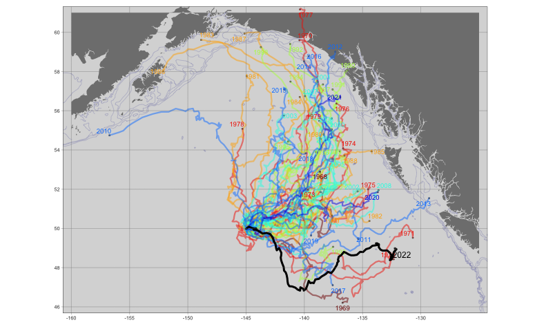
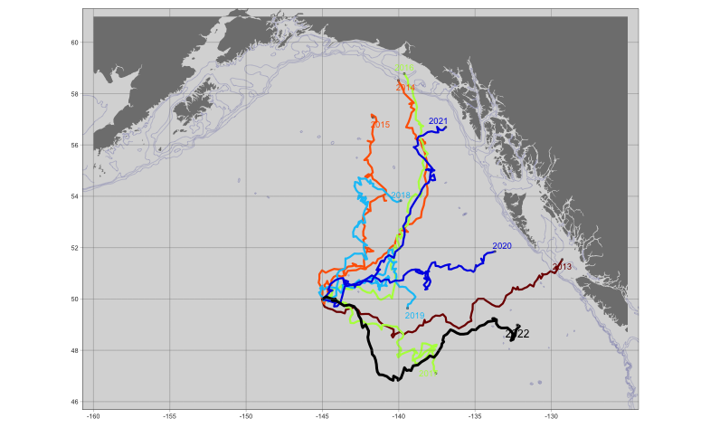
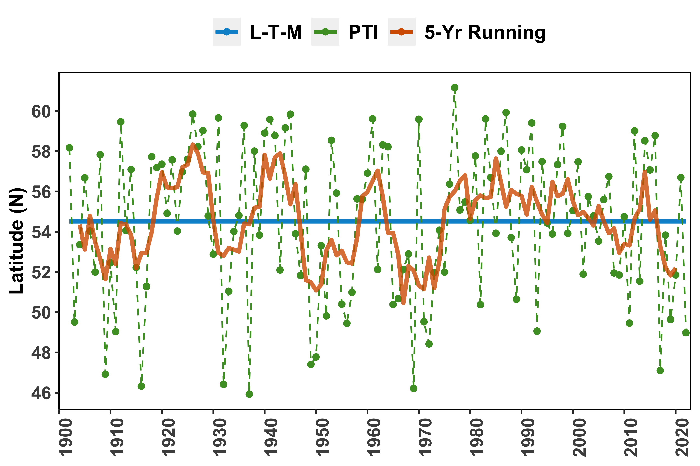

# PAPA_Trajectory_Index

Repo for PAPA Trajectory Index code and results.

## Introduction

The year-to-year variability in near-surface water movements in the North Pacific Ocean has been shown to have important effects on the survival of walleye pollock (Theragra chalcogramma) by affecting its spatial overlap with predators (Wespestad2000), as well as to influence recruitment success of winter spawning flatfish in the eastern Bering Sea (EBS; Wilderbuer2002). The PAPA Trajectory Index (PTI) provides an annual index reflecting broad-scale winter circulation in the northeast Pacific Ocean and Gulf of Alaska based on the 
end location of a simulated surface drifter released on December 1 and tracked for 90 days (i.e., ending on February 29 or March 1 of the subsequent year,
dependent on whether the ending year is a leap year or not), based on the trajectory of a simulated surface drifter released at Ocean Station Papa (50^oN, 145^oW). The simulation for each year is conducted using the “Ocean Surface CURrent Simulator” (OSCURS; http://oceanview.pfeg.noaa.gov/oscurs). Using daily gridded atmospheric pressure fields, OSCURS calculates the speed and direction of water movement at the ocean’s surface at the location of a simulated surface drifter. It uses this information to update the position of the simulated drifter on a daily basis over a specified time period. For the index presented here, OSCURS was run for 90 days to simulate a surface drifter released at Ocean Station Papa on December 1 for each year from 1901 to the current 2021.

The PTI itself is based on the ending latitude of the simulated drifter in each year. Filtered PTI values greater than the long-term mean are indicative of increased transport and/or a northerly shift in the Alaska Current, which transports warm water northward along the west coast of Canada and southeast Alaska from the south and consequently plays a major role in the Gulf of Alaska’s heat budget. Interdecadal changes in the PTI reflect changes in ocean climate that appear to have widespread impacts on biological variability at multiple trophic levels (King2005). There is strong evidence that the productivity and possibly the carrying capacity of the Alaska Gyre and of the continental shelf were enhanced during the “warm” regime that began in 1977. Zooplankton production was positively affected after the 1977 regime shift (Brodeur1992), as were recruitment and survival of salmon and demersal fish species. Recruitment of rockfish (Pacific ocean perch) and flatfish (arrowtooth flounder, halibut, and flathead sole) also increased. However, shrimp and forage fish such as capelin were negatively affected by the 1977 shift (Anderson2003). The reduced availability of forage fish may have contributed to the decline in marine mammal and seabird populations observed after the 1977 shift (Piatt1996). 

## Curent Results 

The following shows the drifter trajectories for all years since 1968:

The following shows the drifter trajectories during the past decade:

The actual PTI is shown in the following figure:

### NOAA README

This repository is a scientific product and is not official communication of the National Oceanic and Atmospheric Administration, or the United States Department of Commerce. All NOAA GitHub project code is provided on an ‘as is’ basis and the user assumes responsibility for its use. Any claims against the Department of Commerce or Department of Commerce bureaus stemming from the use of this GitHub project will be governed by all applicable Federal law. Any reference to specific commercial products, processes, or services by service mark, trademark, manufacturer, or otherwise, does not constitute or imply their endorsement, recommendation or favoring by the Department of Commerce. The Department of Commerce seal and logo, or the seal and logo of a DOC bureau, shall not be used in any manner to imply endorsement of any commercial product or activity by DOC or the United States Government.

### NOAA License

Software code created by U.S. Government employees is not subject to copyright in the United States (17 U.S.C. §105). The United States/Department of Commerce reserve all rights to seek and obtain copyright protection in countries other than the United States for Software authored in its entirety by the Department of Commerce. To this end, the Department of Commerce hereby grants to Recipient a royalty-free, nonexclusive license to use, copy, and create derivative works of the Software outside of the United States.

[U.S. Department of Commerce](https://www.commerce.gov/) | [National
Oceanographic and Atmospheric Administration](https://www.noaa.gov) |
[NOAA Fisheries](https://www.fisheries.noaa.gov/)
